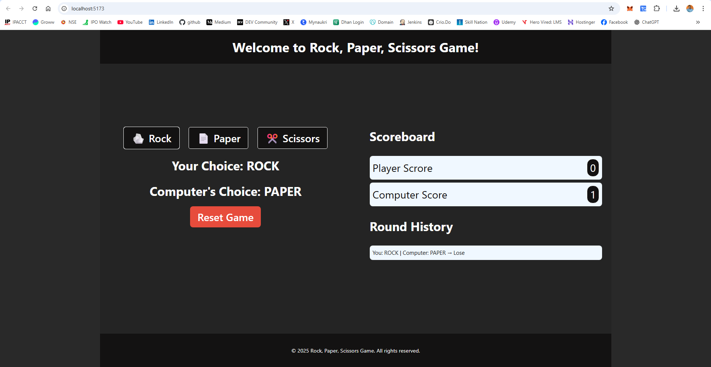
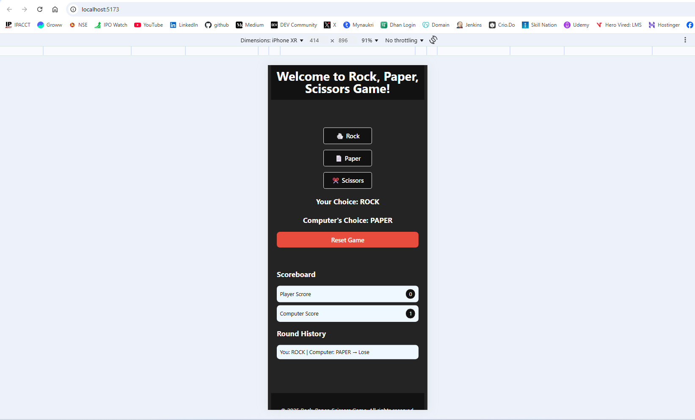

# 🪨📄✂️ Rock-Paper-Scissors React + vite Game

A fully interactive, animated, and responsive **Rock-Paper-Scissors** game built with **React**. It features sound effects, confetti celebration, scoring system, round history, and adaptive dark/light mode using `prefers-color-scheme`.

## 🔗 Live Demo

🌐 [Play Now on Vercel](https://react-rock-paper-scissor-app.vercel.app/)  
📱 Optimized for mobile and desktop

---

## 🎮 Features

- 🎉 Confetti celebration on each win
- 🔊 Sound effects for win, lose, and tie
- 🧠 Smart computer opponent with 500ms delay (feels like thinking)
- 🏆 Win condition (First to 5 points)
- 📜 Real-time round history tracking
- ♻️ Score reset button
- 🧑‍💻 Emoji-based buttons for intuitive interaction
- 📱 Fully responsive layout

---

## 🧑‍💻 Tech Stack

- **React** (Hooks-based)
- **React Toastify** (Notifications)
- **Canvas-Confetti** (Win animation)
- **CSS Flexbox & Media Queries** (Responsive Design)
- **HTML5 Audio** (Sound Effects)

---

## 🛠️ Getting Started

### 1. Clone the repo

```bash
git clone https://github.com/your-username/rock-paper-scissors-react.git
cd rock-paper-scissors-react
```

### 2. Install Dependencies

```bash
npm install
```

### 3. Run the App

```bash
npm run dev
```
Then open `http://localhost:5173` in your browser.

---

## 📁 Project Structure

```bash
├── public/
│   └── sounds/
│       ├── win.mp3
│       ├── lose.mp3
│       └── tie.mp3
├── src/
│   ├── Components/
│   │   └── Game/
│   │       ├── Game.jsx
│   │       └── Game.css
│   ├── App.css
│   ├── App.jsx
│   ├── index.css
│   └── main.jsx
├── index.html
├── vite.config.js
└── README.md

```

---

## 📸 Screenshots
| Desktop Mode                                     | Mobile Mode                                    |
| ------------------------------------------------ | ---------------------------------------------- |
|  |  |

---

📦 Dependencies

```bash

npm install react-toastify canvas-confetti
```

Ensure you add sound files (`win.mp3`, `lose.mp3`, `tie.mp3`) inside `public/sounds/`.

---

## 🙌 Contributing
Pull requests are welcome! Feel free to suggest improvements or new features.

## 📄 License
MIT License. Use freely for educational or commercial purposes.

## 👨‍💻 Author
Surender Gupta
💼 [LinkedIn](htttps://linkedin.com/in/surender-gupta)
🌐 [Github](https://github.com/surendergupta]